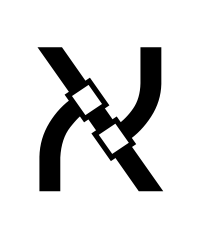

[](https://clojars.org/aleph)
[](https://cljdoc.org/d/aleph/aleph)
[](https://circleci.com/gh/clj-commons/aleph)



Aleph exposes data from the network as a [Manifold](https://github.com/clj-commons/manifold) stream, which can easily be transformed into a `java.io.InputStream`, [core.async](https://github.com/clojure/core.async) channel, Clojure sequence, or [many other byte representations](https://github.com/clj-commons/byte-streams).  It exposes simple default wrappers for HTTP, TCP, and UDP, but allows access to full performance and flexibility of the underlying [Netty](https://github.com/netty/netty) library.

Leiningen:
```clojure
[aleph "0.9.3"]
```
deps.edn:
```clojure
aleph/aleph {:mvn/version "0.9.3"}
;; alternatively
io.github.clj-commons/aleph {:git/sha "..."}
```

### HTTP

#### Server
Aleph follows the [Ring](https://github.com/ring-clojure) spec fully, and can be a drop-in replacement for any existing Ring-compliant server.  However, it also allows for the handler function to return a [Manifold deferred](https://github.com/clj-commons/manifold) to represent an eventual response.  This feature may not play nicely with synchronous Ring middleware which modifies the response, but this can be easily fixed by reimplementing the middleware using Manifold's [let-flow](https://github.com/clj-commons/manifold/blob/master/doc/deferred.md#let-flow) operator. The `aleph.http/wrap-ring-async-handler` helper can be used to convert async 3-arity Ring handler to Aleph-compliant one.

```clojure
(require '[aleph.http :as http])

(defn handler [req]
  {:status 200
   :headers {"content-type" "text/plain"}
   :body "hello!"})

(http/start-server handler {:port 8080}) ; HTTP/1-only

;; To support HTTP/2, do the following:
;; (def my-ssl-context ...)
(http/start-server handler {:port 443
                            :http-versions [:http2 :http1]
                            :ssl-context my-ssl-context})
;; See aleph.examples.http2 for more details
```

The body of the response may also be a Manifold stream, where each message from the stream is sent as a chunk, allowing for precise control over streamed responses for [server-sent events](http://en.wikipedia.org/wiki/Server-sent_events) and other purposes.


#### Client

For HTTP client requests, Aleph models itself after [clj-http](https://github.com/dakrone/clj-http), except that every request immediately returns a Manifold deferred representing the response.

```clojure
(require
  '[aleph.http :as http]
  '[manifold.deferred :as d]
  '[clj-commons.byte-streams :as bs])

(-> @(http/get "https://google.com/")
    :body
    bs/to-string
    prn)

(d/chain (http/get "https://google.com")
         :body
         bs/to-string
         prn)

;; To support HTTP/2, do the following:
(def conn-pool
  (http/connection-pool {:connection-options {:http-versions [:http2 :http1]}}))
@(http/get "https://google.com" {:pool conn-pool})
;; See aleph.examples.http2 for more details
```

Aleph attempts to mimic the clj-http API and capabilities fully. It supports multipart/form-data requests, cookie stores, proxy servers and requests inspection with a few notable differences:

* proxy configuration should be set for the connection when setting up a connection pool, per-request proxy setups are not allowed

* HTTP proxy functionality is extended with tunneling settings, optional HTTP headers and connection timeout control, see [all configuration keys](https://github.com/clj-commons/aleph/blob/d33c76d6c7d1bf9788369fe6fd9d0e56434c8244/src/aleph/http.clj#L122-L132)

* `:proxy-ignore-hosts` is not supported

* both cookies middleware and built-in cookies storages do not support cookie params obsoleted since RFC2965: comment, comment URL, discard, version (see the full structure of the [cookie](https://github.com/clj-commons/aleph/blob/d33c76d6c7d1bf9788369fe6fd9d0e56434c8244/src/aleph/http/client_middleware.clj#L645-L655))

* when using `:debug`, `:save-request?` and `:debug-body?` options, corresponding requests would be stored in `:aleph/netty-request`, `:aleph/request`, `:aleph/request-body` keys of the response map

* `:response-interceptor` option is not supported

* Aleph introduces `:log-activity` connection pool [configuration](https://github.com/clj-commons/aleph/blob/d33c76d6c7d1bf9788369fe6fd9d0e56434c8244/src/aleph/http.clj#L120) to switch on the logging of the connections status changes as well as requests/response hex dumps

* `:cache` and `:cache-config` options are not supported as for now

Aleph client also supports fully async and [highly customizable](https://github.com/clj-commons/aleph/blob/d33c76d6c7d1bf9788369fe6fd9d0e56434c8244/src/aleph/netty.clj#L783-L796) DNS resolver.

To learn more, [read the example code](https://github.com/clj-commons/aleph/blob/master/examples/src/aleph/examples/http.clj).

#### HTTP/2

As of 0.7.0, Aleph supports HTTP/2 in both the client and the server.

For the most part, Aleph's HTTP/2 support is a drop-in replacement for HTTP/1. For backwards compatibility, though, Aleph defaults to HTTP/1-only. See the [the example HTTP/2 code](https://github.com/clj-commons/aleph/blob/master/examples/src/aleph/examples/http2.clj) for a good overview on getting started with HTTP/2.

Things to be aware of:

1. Multipart uploads are not yet supported under HTTP/2, because Netty doesn't support them under HTTP/2. For new development, open a new H2 stream/request for each file instead. (HTTP/2 generally doesn't need multipart, since it doesn't have the same limitations on the number of connections as HTTP/1.) For existing multipart code, stick with HTTP/1. Ideally, this will be added in a future release.
2. Aleph does not currently support the CONNECT method under HTTP/2. Stick with HTTP/1 if you're using CONNECT.
3. Aleph will not support HTTP/2 server push, since it's deprecated, and effectively disabled by Chrome.
4. Aleph does not currently support HTTP/2 trailers (headers arriving after the body).
5. Aleph does nothing with priority information. We would like to expose an API to support user use of prioritization, but the browsers never agreed on how to interpret them, and some (e.g., Safari) effectively never used them. We think back-porting the HTTP/3 priority headers to HTTP/2 is a better aim.
6. Aleph currently uses Netty's default flow control. This is a 64 kb window, which with bytes acknowledged as soon they're received. We plan to add support for adjusting the default window size and flow control strategy in a future release.
7. If you were using `pipeline-transform` to alter the underlying Netty pipeline, you will need to check your usage of it for HTTP/2. Under the hood, the new HTTP/2 code uses Netty's multiplexed pipeline setup, with a shared connection-level pipeline that feeds stream-specific frames to N pipelines created for N individual streams. (A standard HTTP request/response pair maps to a single H2 stream.)

### WebSockets

On any HTTP request which has the proper `Upgrade` headers, you may call `(aleph.http/websocket-connection req)`, which returns a deferred which yields a **duplex stream**, which uses a single stream to represent bidirectional communication.  Messages from the client can be received via `take!`, and sent to the client via `put!`.  An echo WebSocket handler, then, would just consist of:

```clojure
(require '[manifold.stream :as s])

(defn echo-handler [req]
  (let [s @(http/websocket-connection req)]
    (s/connect s s)))
```

This takes all messages from the client, and feeds them back into the duplex socket, returning them to the client.  WebSocket text messages will be emitted as strings, and binary messages as byte arrays.

WebSocket clients can be created via `(aleph.http/websocket-client url)`, which returns a deferred which yields a duplex stream that can send and receive messages from the server.

To learn more, [read the example code](https://github.com/clj-commons/aleph/blob/master/examples/src/aleph/examples/websocket.clj).

### TCP

A TCP server is similar to an HTTP server, except that for each connection the handler takes two arguments: a duplex stream and a map containing information about the client.  The stream will emit byte-arrays, which can be coerced into other byte representations using the [byte-streams](https://github.com/clj-commons/byte-streams) library.  The stream will accept any messages which can be coerced into a binary representation.

An echo TCP server is very similar to the above WebSocket example:

```clojure
(require '[aleph.tcp :as tcp])

(defn echo-handler [s info]
  (s/connect s s))

(tcp/start-server echo-handler {:port 10001})
```

A TCP client can be created via `(aleph.tcp/client {:host "example.com", :port 10001})`, which returns a deferred which yields a duplex stream.

To learn more, [read the example code](https://github.com/clj-commons/aleph/blob/master/examples/src/aleph/examples/tcp.clj).

### UDP

A UDP socket can be generated using `(aleph.udp/socket {:port 10001, :broadcast? false})`.  If the `:port` is specified, it will yield a duplex socket which can be used to send and receive messages, which are structured as maps with the following data:

```clojure
{:host "example.com"
 :port 10001
 :message ...}
```

Where incoming packets will have a `:message` that is a byte-array, which can be coerced using `byte-streams`, and outgoing packets can be any data which can be coerced to a binary representation.  If no `:port` is specified, the socket can only be used to send messages.

To learn more, [read the example code](https://github.com/clj-commons/aleph/blob/master/examples/src/aleph/examples/udp.clj).

### Development

Aleph uses [Leiningen](https://leiningen.org/) for managing dependencies, running REPLs and tests, and building the code.

Minimal [`tools.deps`](https://github.com/clojure/tools.deps.alpha) support is available in the form of a `deps.edn` file which is generated from `project.clj`. It provides just enough to be able to use Aleph as a git or `:local/root` dependency. When committing changes to `project.clj`, run `deps/lein-to-deps` and commit the resulting changes, too.

### License

Copyright © 2010-2024 Zachary Tellman

Distributed under the MIT License.

### Support

Many thanks to YourKit for supporting Aleph. YourKit supports open source projects with innovative and intelligent tools for monitoring and profiling Java and .NET applications.

YourKit is the creator of <a href="https://www.yourkit.com/java/profiler/">YourKit Java Profiler</a>, <a href="https://www.yourkit.com/dotnet-profiler/">YourKit .NET Profiler</a>, and <a href="https://www.yourkit.com/youmonitor/">YourKit YouMonitor</a>.


